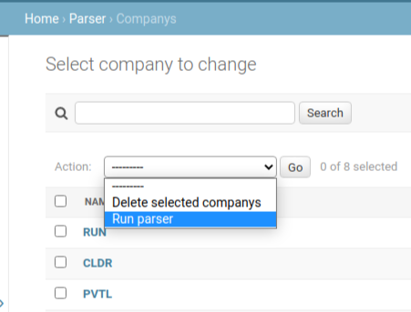

# Yahoo Parser

### Installation
- Create and activate venv:
    ```sh
    $ python3 -m venv yahoo_env
    $ source yahoo_env/bin/activate
    ```

- Install dependencies from requirements.txt:
    ```sh
    $ pip install -r requirements.txt
    ```
- Create migrations and user, run server:
    ```sh
    $ python manage.py makemigrations
    $ python manage.py migrate
    $ python manage.py createsupeuser
    $ python manage.py loaddata fixtures.json
    $ python manage.py runserver
    ```
- Go to [***localhost***](http://127.0.0.1:8000/admin)


### Workflow
- Go [***localhost/admin/parser/company***](http://127.0.0.1:8000/admin/parser/company/).
- Create company (only field 'Name').
- Select objects and run action 'Run parser':

- After processing the data, you will be able to download the appropriate files:
